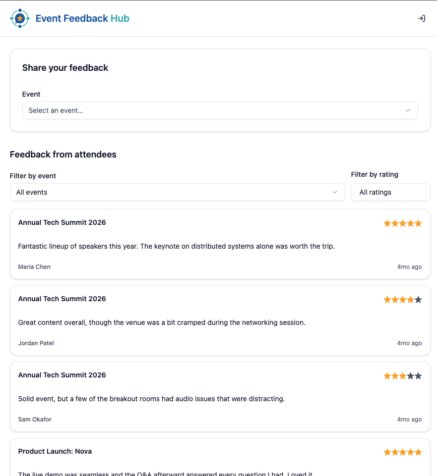

# Event Feedback Hub

> [!CAUTION]
> This code is not meant to be used. It is a demonstration of skill for an interview process. It is advised that you not make use of this repository.

This repo houses a platform that allows users to provide feedback on events they attended and to see feedback that others have provided.



## Requirements

Some elements of the stack have been decided in advance, as is typical in a real-world business setting.

### Stack Requirements

- **Frontend** — React
- **Backend** — Application hosting GraphQL

### Functional Requirements

For the frontend:

- A submission form where users can select an event from a dropdown menu and submit their feedback along with a rating (1-5 stars).
- A real-time feedback stream displaying all feedback for a selected event. Include:
  - The event name.
  - The user's feedback text.
  - The rating given.
- Options to filter or paginate the feedback stream based on event or rating.

For the backend:

- Submission of feedback.
- Retrieval of all feedback for a given event, including filtering
  capabilities.
- Real-time updates when new feedback is submitted.
- A database schema suitable for storing events, feedback submissions, and user ratings.

## Key Decisions

The following are some decisions that needed to be made that were left open in the brief that was given. I chose some of them, frankly, to show off a bit, and others in order to make things easier for the interviewers to evaluate.

### Repo Structure

In the current environment of modern development with agentic AI, I have experienced the incredible surge of productivity provided by having everything in a monorepo. Agentic development tools are slowly getting better with multi-repository development, but I find that they're nowhere near the level of effectiveness and efficiency you get by using a monorepo. For that reason, **[Turborepo](https://turborepo.dev)** was chosen to keep everything together. It's simple, it's easy, and it's fast, requiring little overhead. **[Yarn](https://yarnpkg.com)** was chosen for package management.

### Backend Framework

GraphQL can be served by myriad different frameworks, including just serving GraphQL with Apollo Server, which would make things the easiest, but I chose **[NestJS](https://nestjs.com)** because it's rarely the case that you can get away with a simple data layer alone in a real-world platform like this, and at some point you will require some heavier functionality, i.e. complex business logic, analytics, metrics and observability, etc. I have also seen NestJS listed on a prior job opening, so I wanted to align with what is familiar, and I have quite a bit of experience with NestJS. For NestJS, GraphQL can be used schema-first or code-first, and I chose the code-first path so that the application code and the data definitions are all written in the same language (TypeScript), which causes less context-switching for engineers.

### Database

The database requirement was left completely open. In order to ease some pain for interviewers, **[SQLite](https://sqlite.org)** was chosen so that I could upload a file containing populated data for them to look at during the evaluation. This ensures that there are events with feedback to look at when the application bootstraps the first time. **[TypeORM](https://typeorm.io)** was chosen for the ORM data layer within NestJS, which is fairly standard.

### Frontend Framework

The use of React was a requirement, but there are many ways to do this. **[Vite](https://vite.dev)** was chosen as the build/server tooling for speed and simplicity, because this project does not require heavy server-side functionality and there is no need to bloat it with something like Next.js for this type of project.

### Design Libraries

I am not a designer. For a demonstration project, choosing a simple styling library as well as a lightweight component library made sense. For styling, **[Tailwind](https://tailwindcss.com)** was chosen, which is pretty standard. For components, I am using **[shadcn/ui](https://ui.shadcn.com)** to keep the need for a large, unnecessary dependency out of the project.

### Data Fetching

**[Apollo Client](https://www.apollographql.com/docs/react)** was chosen for the data fetching. It makes sense given Apollo Server. One requirement of the project was the ability to see realtime feedback, which requires a method of asynchronous client/server updates. The GraphQL requirement and Apollo Client/Server makes choosing **[graphql-ws](https://github.com/enisdenjo/graphql-ws)** the clear choice. For pagination, I used offset-based pagination for its simplicity and for the fact that the size of the dataset for any given event is unlikely to cause performance issues in a production web application. I would usually not over-engineer this particular type of thing until the pain became obvious (_if_ it did).

### Authentication

Authentication was not asked for, but I wanted to add it because it's a fairly common feature in these sorts of applications (requiring sign-in before reviews). For the authentication, I started a new **[Clerk]https://clerk.com/)** account. I placed the environment variables for the development keys in the committed files, which is not normal practice but it should make things easier to review. I will be wiping the keys once the evaluation is completed.

### Testing

Functionality is not complete without testing. In fact, I prefer to use test-driven development. With the agentic AI age in which we live, this is done sometimes by me writing the tests and asking the agent to make them pass without altering the tests or otherwise tell me why the tests are flawed. In any case, tests are written, which is the most important part.

### Extras

I have added a GitHub Actions workflow to run common CI tasks, such as linting, typechecking, and tests.

## Agent Interactions

To help you see how I work, I have added `docs/agent-interactions`, which has numbered subdirectories with agent transcripts exported into each. If there was a plan involved, the plan will be in the folder as well. Hopefully this allows you to see my iterative process using AI development.

## Getting Started

### Prerequisites

- **Node.js `24.18.0`** — an `.nvmrc` and `.node-version` are provided, so `nvm use` (or the Node version manager of your choice) will select the right version.
- **[Corepack](https://nodejs.org/api/corepack.html)** — run `corepack enable` once so the pinned `packageManager` version of Yarn is used automatically.

### Install

From the repository root:

```bash
corepack enable
yarn install
```

### Running

> [!WARNING]
> The `.env` file has been committed to source control for the `api` application, which is abnormal. I did this to make it easier for evaluators to run the application locally without fiddling around with environment variables.

To start the development server:

```bash
yarn dev
```

The application can be viewed at [http://localhost:1337/](http://localhost:1337/).

The database has been committed to source control so that information can already been populated for evaluators.
